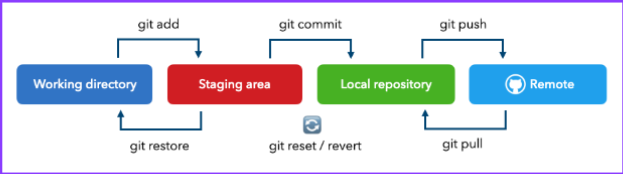
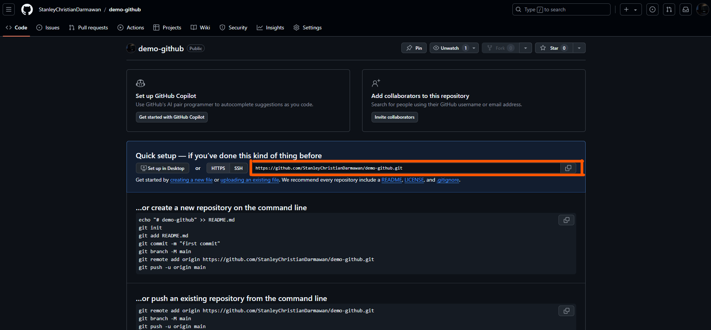
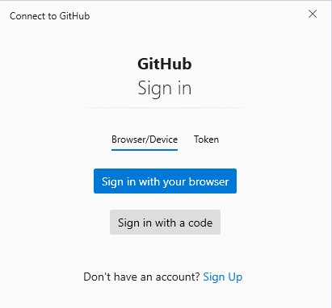
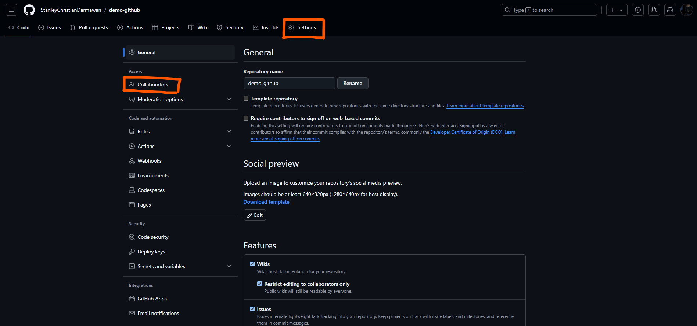

#### 1. **Buat 1 folder untuk menyimpan semua file code**

#### 2. **Inisialisasi Git Repository**
- Buka foldernya lalu klik address bar di file explorer
- Di dalam folder proyek tersebut, inisialisasi repository Git lokal:
```bash
git init
```

#### 2. **Cek Status Repository**
- Untuk melihat letak file berada di *Working Directory* atau *Staging Area* gunakan:

```bash
git status
```


- Jika text berwarna merah artinya masih ada di *Working Directory*
- Jika text berwarna hijau artinya sudah berada di *Staging Area*

#### 3. **Masukkan File dari Working Directory ke Staging Area**
- Saat melakukan perubahan atau menambahkan file baru, filenya tuh masih ada di working directory. Nah cara masukkin ke staging areanya gunakan *command* ini:
```bash
git add index.html
```
- Pastikan "index.html" kalian ganti dengan nama file kalian atau kalian bisa menggunakan "git add ." untuk menambahkan semua file secara langsung
- Kalo kalian *git status* lagi maka file yang tadinya berwarna merah akan jadi berwarna hijau, itu mengindikasikan bahwa file sudah masuk ke *staging area*
#### 4. **Masukkan File dari Staging Area ke Local Repository**
- Digunakan untuk menyimpan (merekam) perubahan yang telah ditambahkan ke **staging area** ke dalam **repository**.
```bash
git commit -m "Masukkan pesan disini"

contohnya

git commit -m "add index.html file"
```

#### 5. **Membuat Repository di GitHub**
- Pergi ke GitHub dan buat repository baru.
#### 6. **Menghubungkan Git Lokal ke Repository GitHub**
- Salin URL repository dari GitHub.

- Buka kembali terminal kalian lalu ketik
```bash
git remote add origin https://github.com/StanleyChristianDarmawan/demo-github.git
```
Pastikan link yang kalian masukkan merupakan link dari repository kalian.

#### 6. **Push File dari Lokal ke Repository Github**
```bash
git push -u origin master
```
- abis push seharusnya disuruh login seperti ini:

- ini klik "Sign in with your browser" aja nanti otomatis ke sign ini kalo udah login github di browsernya.

#### 6. **Mengecek Hasil di GitHub**
- Refresh browser kalian dan pastikan file sudah terupload dengan benar


## Cara kolaborasi:
---
Klik *setting* di *repository* github kalian lalu klik *Collaborators*

- Kalian bisa klik *Add People* lalu ketikkan username github teman kalian.
- Setelah ditambah minta teman kalian untuk cek email untuk menerima *invitation* dari kalian.

#### **Clone Repository**
- Setelah menerima invite dari teman kalian maka kalian bisa clone *repository* teman kalian dengan cara:
```bash
git clone https://github.com/StanleyChristianDarmawan/demo-github
```
- Pastikan link yang kalian tulis merupakan link repository teman kalian